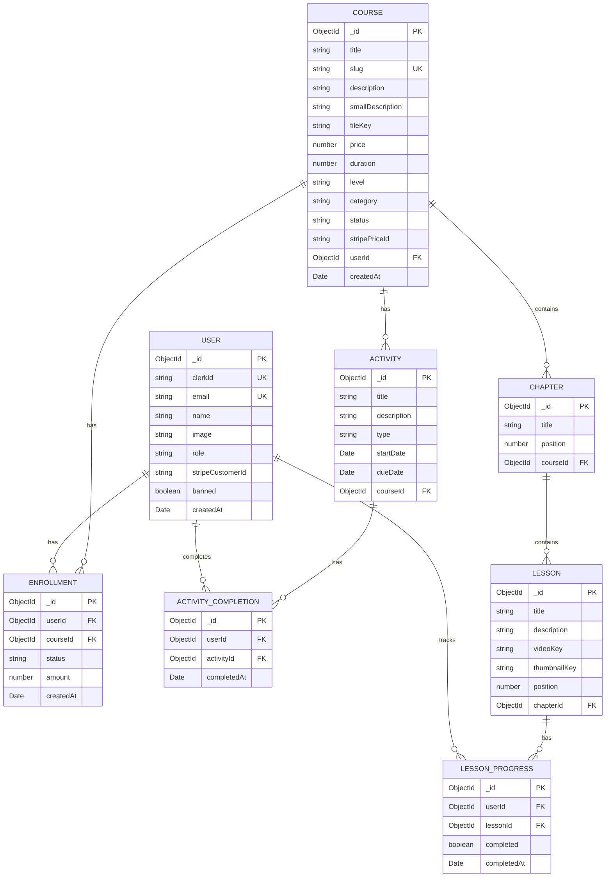

# Learnix - Modern Learning Management System

<div align="center">

<!--  -->

**A full-featured learning management system built with Next.js 15, Express.js, and MongoDB**

[](https://nextjs.org/)
[](https://expressjs.com/)
[](https://mongodb.com/)
[](https://typescriptlang.org/)
[](LICENSE)

<!-- [Live Demo](https://learnix-sepia.vercel.app) -->

</div>


<!-- ## 📸 Screenshots -->

---
<br />

<div align="center">
  
  
</div>

<div align="center">
  
  
</div>

## ✨ Features

### For Students
- 🎓 **Course Discovery** - Browse and search through published courses with real-time search
- 💳 **Seamless Enrollment** - Enroll in free or paid courses with Stripe integration
- 📹 **Video Learning** - Watch video lessons with automatic progress tracking
- 📊 **Progress Dashboard** - Track course completion and view enrolled courses
- 📝 **Activity Assignments** - View and complete course activities with due dates
- 🌙 **Dark Mode Support** - Toggle between light and dark themes

### For Instructors/Admins
- ✏️ **Course Management** - Create, edit, and publish courses with rich content
- 📚 **Chapter Organization** - Structure courses with chapters and lessons
- ☁️ **Cloud Storage** - Upload videos and thumbnails directly to AWS S3
- 🎯 **Activity Creation** - Create assignments and activities with deadlines
- 📈 **Analytics Dashboard** - View enrollment statistics and user engagement
- 👥 **User Management** - Manage users and assign roles (Admin, Instructor, User)

### Platform Features
- 🔐 **Secure Authentication** - Clerk-powered auth with role-based access control
- 📱 **Mobile Responsive** - Mobile-first design works seamlessly on all devices
- 🚀 **Fast Performance** - Server-side rendering with Next.js 15 App Router
- 🔍 **Instant Search** - Real-time course search with debouncing
- 💰 **Payment Processing** - Secure Stripe integration for course purchases
- 🎨 **Modern UI** - Beautiful interface built with Tailwind CSS and shadcn/ui

## 🏗️ Project Structure

```
learnix/
├── frontend/                     # Next.js 15 Frontend Application
│   ├── app/                      # App Router (Next.js 15)
│   │   ├── (public)/             # Public routes
│   │   │   ├── courses/          # Course browsing & details
│   │   │   └── about/            # About page
│   │   ├── admin/                # Admin dashboard
│   │   │   ├── courses/          # Course management
│   │   │   ├── activities/       # Activity management
│   │   │   ├── users/            # User management
│   │   │   └── dashboard/        # Analytics & stats
│   │   ├── dashboard/            # Student dashboard
│   │   │   └── [slug]/           # Course learning interface
│   │   ├── api/                  # API routes
│   │   │   ├── admin/            # Admin endpoints
│   │   │   ├── user/             # User endpoints
│   │   │   ├── webhook/          # Webhooks (Stripe, Clerk)
│   │   │   └── s3/               # S3 file operations
│   │   └── data/                 # Server-side data fetching
│   ├── components/               # React components
│   │   └── ui/                   # shadcn/ui components
│   ├── hooks/                    # Custom React hooks
│   ├── lib/                      # Utility libraries
│   │   ├── api-client.ts         # Backend API client
│   │   └── utils.ts              # Helper functions
│   └── public/                   # Static assets
│
├── backend/                      # Express.js Backend Application
│   ├── src/
│   │   ├── config/               # Configuration files
│   │   │   ├── database.ts       # MongoDB connection
│   │   │   └── env.ts            # Environment variables
│   │   ├── controllers/          # Request handlers
│   │   │   ├── user.controller.ts
│   │   │   ├── course.controller.ts
│   │   │   ├── chapter.controller.ts
│   │   │   ├── lesson.controller.ts
│   │   │   ├── enrollment.controller.ts
│   │   │   └── activity.controller.ts
│   │   ├── middleware/           # Express middleware
│   │   │   ├── auth.ts           # Clerk JWT verification
│   │   │   ├── requireUser.ts    # User requirement check
│   │   │   └── errorHandler.ts   # Global error handling
│   │   ├── models/               # Mongoose schemas
│   │   │   ├── User.ts
│   │   │   ├── Course.ts
│   │   │   ├── Chapter.ts
│   │   │   ├── Lesson.ts
│   │   │   ├── Enrollment.ts
│   │   │   ├── LessonProgress.ts
│   │   │   ├── Activity.ts
│   │   │   └── ActivityCompletion.ts
│   │   ├── routes/               # API route definitions
│   │   ├── services/             # Business logic layer
│   │   └── utils/                # Utility functions
│   │       ├── apiResponse.ts    # Response formatter
│   │       ├── apiError.ts       # Error classes
│   │       └── logger.ts         # Winston logger
│   └── dist/                     # Compiled TypeScript output
│
├── docs/                         # Additional documentation
└── README.md                     # This file
```

## 🛠️ Tech Stack

### Frontend
| Technology | Purpose |
|------------|---------|
| **Next.js 15** | React framework with App Router |
| **React 19** | UI library for component-based development |
| **TypeScript** | Type-safe JavaScript superset |
| **Tailwind CSS** | Utility-first CSS framework |
| **shadcn/ui** | Re-usable component library |
| **Lucide React** | Modern icon library |
| **Tabler Icons** | Additional icon set |
| **Clerk** | Authentication and user management |

### Backend
| Technology | Purpose |
|------------|---------|
| **Node.js** | JavaScript runtime environment |
| **Express.js** | Fast, minimalist web framework |
| **TypeScript** | Type-safe JavaScript |
| **Mongoose** | MongoDB ODM for data modeling |
| **Zod** | Schema validation library |
| **Winston** | Flexible logging library |

### Database & Storage
| Technology | Purpose |
|------------|---------|
| **MongoDB** | NoSQL database for flexible data storage |
| **MongoDB Atlas** | Cloud-hosted database service |
| **AWS S3** | Object storage for videos and images |

### Payment & Services
| Technology | Purpose |
|------------|---------|
| **Stripe** | Payment processing and subscriptions |
| **Clerk** | User authentication and management |
| **Vercel** | Frontend deployment and hosting |
| **Railway/Render** | Backend deployment platform |

## 🏛️ Architecture

```
┌─────────────────────────────────────────────────────────────────┐
│                         CLIENT BROWSER                          │
└─────────────────────────────────────────────────────────────────┘
                                │
                                ▼
┌─────────────────────────────────────────────────────────────────┐
│                      FRONTEND (Next.js 15)                      │
│  ┌─────────────┐  ┌─────────────┐  ┌─────────────────────────┐  │
│  │   Pages     │  │ Components  │  │    Server Actions       │  │
│  │  (App Dir)  │  │  (shadcn)   │  │   (API Calls)           │  │
│  └─────────────┘  └─────────────┘  └─────────────────────────┘  │
└─────────────────────────────────────────────────────────────────┘
                                │
                         REST API Calls
                                │
                                ▼
┌─────────────────────────────────────────────────────────────────┐
│                    BACKEND (Express.js)                         │
│  ┌─────────────┐  ┌─────────────┐  ┌─────────────────────────┐  │
│  │   Routes    │  │ Controllers │  │       Services          │  │
│  └─────────────┘  └─────────────┘  └─────────────────────────┘  │
│  ┌─────────────┐  ┌─────────────┐  ┌─────────────────────────┐  │
│  │ Middleware  │  │   Models    │  │       Utils             │  │
│  │ (Auth/CORS) │  │ (Mongoose)  │  │   (Logger/Response)     │  │
│  └─────────────┘  └─────────────┘  └─────────────────────────┘  │
└─────────────────────────────────────────────────────────────────┘
                                │
                                ▼
┌───────────────────┐  ┌──────────────┐  ┌────────────────────────┐
│     MongoDB       │  │   AWS S3     │  │       Stripe           │
│   (Database)      │  │  (Storage)   │  │     (Payments)         │
└───────────────────┘  └──────────────┘  └────────────────────────┘
```

### Data Flow

1. **User Request** → Frontend (Next.js) receives user interaction
2. **API Call** → Backend (Express.js) via REST endpoints
3. **Authentication** → Clerk JWT token verification middleware
4. **Authorization** → Role-based access control check
5. **Data Processing** → Service layer handles business logic
6. **Database Query** → MongoDB operations via Mongoose ODM
7. **Response** → Formatted JSON response back to frontend
8. **UI Update** → React components re-render with new data


### Prerequisites

Before you begin, ensure you have the following installed:
- **Node.js** v18 or higher
- **Bun** (optional, for faster frontend builds)
- **MongoDB** (local installation or MongoDB Atlas account)
- **Clerk Account** for authentication
- **Stripe Account** for payment processing
- **AWS S3 Bucket** for file storage

### Environment Variables

#### Frontend (`frontend/.env`)

```env
# Clerk Authentication
NEXT_PUBLIC_CLERK_PUBLISHABLE_KEY=pk_test_xxxxx
CLERK_SECRET_KEY=sk_test_xxxxx

# Backend API
NEXT_PUBLIC_API_URL=http://localhost:5000/api

# Stripe
STRIPE_SECRET_KEY=sk_test_xxxxx
STRIPE_WEBHOOK_SECRET=whsec_xxxxx

# AWS S3
AWS_ACCESS_KEY_ID=xxxxx
AWS_SECRET_ACCESS_KEY=xxxxx
AWS_REGION=us-east-1
AWS_ENDPOINT_URL_S3=https://s3.us-east-1.amazonaws.com
NEXT_PUBLIC_S3_BUCKET_NAME_IMAGES=your-bucket-name
```

#### Backend (`backend/.env`)

```env
# Server Configuration
NODE_ENV=development
PORT=5000

# MongoDB
MONGODB_URI=mongodb://localhost:27017/learnix

# Clerk Authentication
CLERK_SECRET_KEY=sk_test_xxxxx
CLERK_PUBLISHABLE_KEY=pk_test_xxxxx

# Admin Users (comma-separated emails)
ADMIN_EMAILS=admin@example.com,superadmin@example.com

# Stripe Payment
STRIPE_SECRET_KEY=sk_test_xxxxx
STRIPE_WEBHOOK_SECRET=whsec_xxxxx

# AWS S3 Storage
AWS_ACCESS_KEY_ID=xxxxx
AWS_SECRET_ACCESS_KEY=xxxxx
AWS_REGION=us-east-1
AWS_ENDPOINT_URL_S3=https://s3.us-east-1.amazonaws.com
S3_BUCKET_NAME=your-bucket-name

# CORS
FRONTEND_URL=http://localhost:3000
```


### Core Endpoints

#### Users
| Method | Endpoint | Description | Auth Required |
|--------|----------|-------------|---------------|
| POST | `/users/sync` | Sync/create user from Clerk | ✅ |
| GET | `/users/profile` | Get current user profile | ✅ |
| GET | `/users` | Get all users | ✅ Admin |

#### Courses
| Method | Endpoint | Description | Auth Required |
|--------|----------|-------------|---------------|
| GET | `/courses` | Get all published courses | ❌ |
| GET | `/courses/:slug` | Get course details by slug | ❌ |
| GET | `/courses/search?q=query` | Search courses | ❌ |
| POST | `/courses` | Create new course | ✅ Admin |
| PUT | `/courses/:id` | Update course | ✅ Admin |
| DELETE | `/courses/:id` | Delete course | ✅ Admin |
| GET | `/courses/admin` | Get all courses (including unpublished) | ✅ Admin |

#### Chapters
| Method | Endpoint | Description | Auth Required |
|--------|----------|-------------|---------------|
| GET | `/chapters/course/:courseId` | Get all chapters for a course | ✅ |
| POST | `/chapters` | Create new chapter | ✅ Admin |
| PUT | `/chapters/:id` | Update chapter | ✅ Admin |
| DELETE | `/chapters/:id` | Delete chapter | ✅ Admin |
| POST | `/chapters/reorder` | Reorder chapters | ✅ Admin |

#### Lessons
| Method | Endpoint | Description | Auth Required |
|--------|----------|-------------|---------------|
| GET | `/lessons/:id/content` | Get lesson content | ✅ |
| POST | `/lessons` | Create new lesson | ✅ Admin |
| PUT | `/lessons/:id` | Update lesson | ✅ Admin |
| DELETE | `/lessons/:id` | Delete lesson | ✅ Admin |
| POST | `/lessons/:id/progress` | Update lesson progress | ✅ |

#### Enrollments
| Method | Endpoint | Description | Auth Required |
|--------|----------|-------------|---------------|
| GET | `/enrollments/check/:courseId` | Check enrollment status | ✅ |
| GET | `/enrollments/my-courses` | Get user's enrolled courses | ✅ |
| POST | `/enrollments` | Create enrollment | ✅ |

#### Activities
| Method | Endpoint | Description | Auth Required |
|--------|----------|-------------|---------------|
| GET | `/activities` | Get user's activities | ✅ |
| GET | `/activities/course/:courseId` | Get course activities | ✅ Admin |
| POST | `/activities` | Create activity | ✅ Admin |
| PUT | `/activities/:id` | Update activity | ✅ Admin |
| DELETE | `/activities/:id` | Delete activity | ✅ Admin |
| POST | `/activities/:id/complete` | Mark activity as complete | ✅ |


## 💾 Database Schema

### Entity Relationship Diagram



## 🔐 Authentication & Authorization

### Authentication Flow

1. User signs in via Clerk (Social OAuth or Email/Password)
2. Clerk provides JWT token to client
3. Frontend stores token and includes it in API request headers
4. Backend middleware verifies JWT signature with Clerk
5. User data is synced to MongoDB on first login
6. User role is stored in both MongoDB and Clerk publicMetadata for instant access

### Role-Based Access Control

| Role | Permissions |
|------|-------------|
| **User** | Browse courses, enroll in courses, view lessons, track progress, complete activities |
| **Instructor** | All User permissions + Create and manage own courses |
| **Admin** | Full access to all features, user management, course management, analytics |

### Setting Admin Users

update user roles directly in DataBase


## ⚡ Performance Optimization

### Frontend Optimizations
- **Server Components** - Leveraging Next.js 15 React Server Components for faster initial page loads
- **Image Optimization** - Next.js Image component with automatic WebP conversion and lazy loading
- **Code Splitting** - Automatic route-based code splitting reduces bundle size
- **Instant Role Loading** - User roles cached in Clerk metadata for zero-delay authorization
- **Background Sync** - Non-blocking user synchronization improves perceived performance

### Backend Optimizations
- **Lean Queries** - Using Mongoose `.lean()` method for 50% faster read operations
- **Database Indexing** - Strategic indexes on frequently queried fields (email, slug, clerkId)
- **Connection Pooling** - MongoDB connection reuse reduces latency
- **Selective Projections** - Fetching only required fields reduces data transfer
- **Response Compression** - Gzip compression for API responses

### Caching Strategy
- Clerk metadata caching for instant role access
- Static page generation for public routes
- Client-side state caching with React state management
- Browser caching headers for static assets

## 🔒 Security

### Implemented Security Measures

- ✅ **Authentication** - Clerk JWT verification on all protected routes
- ✅ **Authorization** - Role-based access control with middleware
- ✅ **CORS** - Configured allowed origins to prevent unauthorized access
- ✅ **Helmet** - Security headers to prevent common vulnerabilities
- ✅ **Input Validation** - Zod schema validation on all inputs
- ✅ **NoSQL Injection Prevention** - Mongoose ODM with parameterized queries
- ✅ **XSS Protection** - React's built-in escaping and CSP headers
- ✅ **CSRF Protection** - SameSite cookie attributes
- ✅ **Rate Limiting** - Configurable rate limiting with Arcjet
- ✅ **Environment Variables** - Sensitive data stored securely in `.env` files
- ✅ **HTTPS Only** - Enforced in production environments


---

<div align="center">

**Made with ❤️ by the Learnix Team**

If you found this project helpful, please give it a ⭐!

</div>