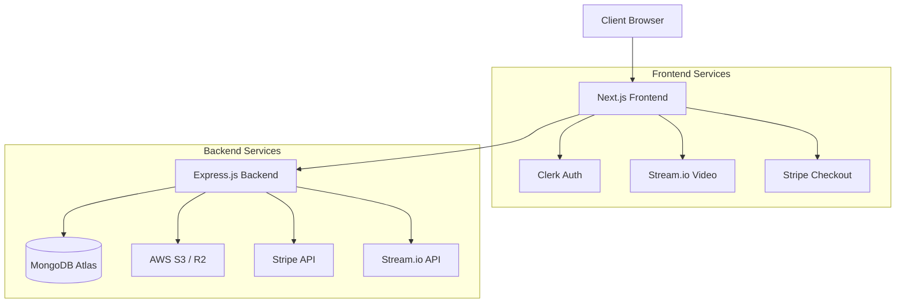
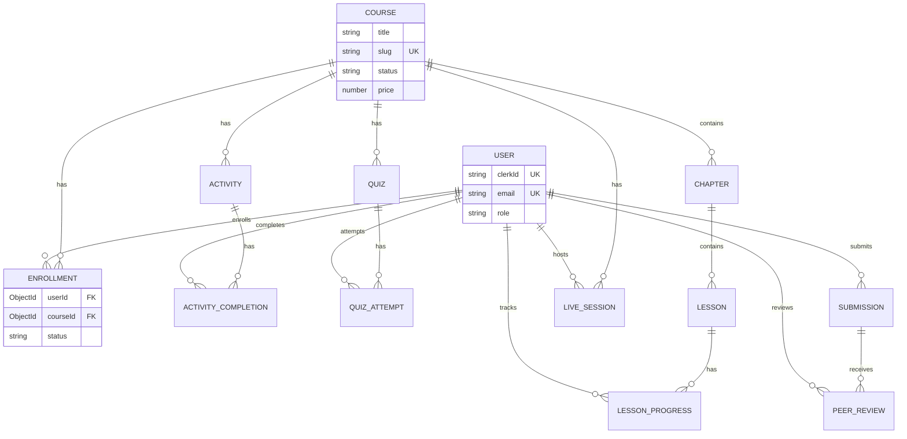

# Learnix - Modern Learning Management System


A full-featured learning management system built with Next.js 15, Express.js, and MongoDB

[](https://nextjs.org/)
[](https://expressjs.com/)
[](https://mongodb.com/)
[](https://typescriptlang.org/)
[](https://tailwindcss.com/)
[](LICENSE)

---


---

## ✨ Features

### 🎓 For Students

- **Course Discovery** — Browse, search, and filter published courses with real-time debounced search
- **Seamless Enrollment** — Enroll in free or paid courses via Stripe Checkout integration
- **Video Learning** — Watch video lessons with automatic progress tracking and completion marking
- **Progress Dashboard** — Track course completion with circular SVG progress charts and milestone badges (25%/50%/75%/100%)
- **Quiz System** — Attempt quizzes with eligibility checks, time limits, randomized questions, and detailed result review
- **Assignments** — View and submit assignments with file uploads, peer reviews, and instructor grading
- **Activity Tracking** — View and complete course-specific activities with due dates
- **Live Sessions** — Join Stream.io video meetings for live lectures (device setup, layout switching)
- **Dark/Light Mode** — Toggle between themes with persistent preference

### 👨‍🏫 For Mentors (Instructors)

- **Course Management** — Create, edit, and publish courses with rich text descriptions (TipTap editor)
- **Chapter & Lesson Organization** — Structure courses with chapters, lessons, and drag-and-drop reordering (dnd-kit)
- **Cloud Storage** — Upload videos and thumbnails to AWS S3 / Cloudflare R2
- **Quiz Builder** — Create quizzes with multiple question types, passing scores, time limits, and max attempts
- **Assignment Management** — Create assignments with rubrics and file submission requirements
- **Live Session Hosting** — Schedule and host live video sessions via Stream.io (start/end lifecycle)
- **Student Progress View** — Monitor enrolled students' progress, quiz results, and submissions
- **Mentor Dashboard** — Personal analytics with enrollment stats and course performance metrics

### 🔧 For Admins

- **User Management** — View, search, and manage all users with role assignments (User/Mentor/Admin) and ban capabilities
- **Global Course Management** — Manage all courses including unpublished ones (edit, delete, publish/unpublish)
- **Analytics Dashboard** — View platform-wide stats with Recharts/Tremor visualizations (enrollments, revenue, user growth)
- **Activity Management** — Create and manage activities across all courses

### 🏗️ Platform Features

- **Clerk Authentication** — Social OAuth + Email/Password with role-based access control
- **Stripe Payments** — Secure checkout flow with webhook-driven enrollment confirmation
- **Arcjet Security** — Rate limiting, bot protection, and request shielding on frontend
- **Responsive Design** — Mobile-first approach with Tailwind CSS responsive breakpoints
- **Server Components** — Next.js 15 App Router with Server Components + Turbopack dev server
- **Real-time Search** — Debounced search with instant results
- **Rich Text Editor** — TipTap-based WYSIWYG editor with text alignment and formatting
- **Data Tables** — TanStack React Table with sorting, filtering, and pagination
- **Confetti Celebrations** — canvas-confetti for quiz completion and milestone achievements

---

## 🎨 Design System

Learnix uses a meticulously crafted design system featuring a vibrant **Deep Orange/Red** primary color palette and modern **Geist** typography.

### Color Palette (Oklch)

The entire UI is themed using CSS variables with Oklch color spaces for superior vibrancy and accessibility.

| Color Role | Light Mode | Dark Mode | Usage |
| :--- | :--- | :--- | :--- |
| **Primary** | `oklch(0.555 0.145 49.0)` | `oklch(0.705 0.187 47.6)` | Main brand color, Buttons, Links |
| **Secondary** | `oklch(0.828 0.075 74.4)` | `oklch(0.444 0.010 73.6)` | Subtle backgrounds, Badges |
| **Accent** | `oklch(0.900 0.050 75.0)` | `oklch(0.360 0.050 229.3)` | Highlights, Interactive states |
| **Destructive** | `oklch(0.444 0.161 26.9)` | `oklch(0.577 0.215 27.3)` | Errors, Delete actions |
| **Background** | `oklch(0.989 0.006 84.6)` | `oklch(0.216 0.006 56.0)` | Page background |
| **Card** | `oklch(0.969 0.009 78.3)` | `oklch(0.269 0.006 34.3)` | Card surfaces |

### Typography

- **Headings & Body**: [Geist Sans](https://vercel.com/font) — A modern, geometric sans-serif typeface designed for legibility.
- **Code**: [Geist Mono](https://vercel.com/font) — A monospaced font for code blocks and technical data.
- **Serif Accents**: [Instrument Serif](https://fonts.google.com/specimen/Instrument+Serif) — Used sparingly for elegant headers and quotes.

### UI Patterns

- **Glassmorphism**: Subtle backdrop blurs on sticky navbars and modal overlays.
- **Micro-interactions**: `framer-motion` layout transitions and hover lifts.
- **Shadows**: Deep, layered shadows (`shadow-xl`) for elevated cards.
- **Radius**: `0.3rem` / `0.5rem` consistent border radius.

---

## 🏗️ Project Structure

```bash
learnix/
├── frontend/                          # Next.js 15 Frontend Application
│   ├── app/                           # App Router (Next.js 15)
│   │   ├── (auth)/                    # Authentication pages (sign-in, sign-up)
│   │   ├── (public)/                  # Public routes (home, courses, about)
│   │   │   ├── courses/               # Course browsing & detail pages
│   │   │   └── about/                 # About page
│   │   ├── admin/                     # Admin dashboard
│   │   │   ├── courses/               # Course CRUD (create, edit, chapters)
│   │   │   ├── activities/            # Activity management
│   │   │   ├── users/                 # User management & role assignment
│   │   │   └── dashboard/             # Admin analytics & stats
│   │   ├── dashboard/                 # Student dashboard
│   │   │   ├── (main)/               # Main dashboard (enrolled courses, profile)
│   │   │   └── [slug]/               # Course learning interface
│   │   │       ├── _components/      # Course tabs (Overview, Lessons, Live, Progress, Quizzes)
│   │   │       ├── [lessonId]/       # Individual lesson viewer
│   │   │       └── quiz/             # Quiz taking & results
│   │   ├── mentor/                    # Mentor dashboard & management
│   │   ├── live/                      # Live session pages (Stream.io)
│   │   │   └── [sessionId]/          # Individual meeting room
│   │   ├── payment/                   # Payment success/callback pages
│   │   ├── api/                       # API routes
│   │   │   ├── admin/                # Admin S3 upload endpoints
│   │   │   ├── user/                 # User sync endpoint
│   │   │   ├── webhook/             # Stripe & Clerk webhooks
│   │   │   └── s3/                  # S3 presigned URL generation
│   │   └── data/                     # Server-side data fetching functions
│   │       ├── course/              # Course, lesson, enrollment data
│   │       ├── live/                # Live session join actions
│   │       └── admin/               # Admin-specific data fetching
│   ├── components/                   # React components
│   │   ├── ui/                      # shadcn/ui components (40+ components)
│   │   ├── live/                    # Live session components (7 components)
│   │   ├── quiz/                    # Quiz components (5 components)
│   │   ├── rich-text-editor/        # TipTap editor components
│   │   ├── file-uploader/           # S3 file upload components
│   │   └── search/                  # Search modal component
│   ├── hooks/                        # Custom React hooks
│   ├── lib/                          # Utility libraries
│   │   ├── api-client.ts            # Backend API client (GET/POST/PUT/DELETE)
│   │   ├── quiz-api.ts              # Quiz-specific API client
│   │   └── utils.ts                 # Helper functions
│   └── public/                       # Static assets
│
├── backend/                           # Express.js Backend Application
│   └── src/
│       ├── config/                   # Configuration files
│       │   ├── database.ts           # MongoDB connection
│       │   └── env.ts               # Zod-validated environment variables
│       ├── controllers/              # Request handlers (15 controllers)
│       ├── middleware/               # Express middleware (7 files)
│       │   ├── auth.ts              # Clerk JWT verification
│       │   ├── requireUser.ts       # User requirement check
│       │   ├── requireAdmin.ts      # Admin role guard
│       │   ├── requireMentor.ts     # Mentor role guard
│       │   └── errorHandler.ts      # Global error handling
│       ├── models/                   # Mongoose schemas (14 models)
│       │   ├── User.ts              # User profile with roles
│       │   ├── Course.ts            # Course with chapters
│       │   ├── Chapter.ts           # Course chapter
│       │   ├── Lesson.ts            # Video lesson
│       │   ├── Enrollment.ts        # Student enrollment
│       │   ├── LessonProgress.ts    # Lesson completion tracking
│       │   ├── Activity.ts          # Course activity
│       │   ├── ActivityCompletion.ts # Activity completion tracking
│       │   ├── LiveSession.ts       # Stream.io live session
│       │   ├── Quiz.ts              # Quiz with questions
│       │   ├── QuizAttempt.ts       # Quiz attempt with answers
│       │   ├── Submission.ts        # Assignment submission
│       │   └── PeerReview.ts        # Peer review for submissions
│       ├── routes/                   # API route definitions (13 files)
│       ├── services/                 # Business logic layer (15 services)
│       ├── validations/             # Zod validation schemas (8 files)
│       └── utils/                   # Utility functions
│           ├── apiResponse.ts       # Standardized response formatter
│           ├── apiError.ts          # Custom error classes
│           ├── logger.ts            # Winston logger
│           └── id-resolver.ts       # Course ID/slug resolver
│
└── README.md                         # This file
```

---

## 🛠️ Tech Stack

### Frontend

| Technology | Version | Purpose |
| :--- | :--- | :--- |
| **Next.js** | 15.5 | React framework with App Router + Turbopack |
| **React** | 18.2 | UI library for component-based development |
| **TypeScript** | 5.x | Type-safe JavaScript superset |
| **Tailwind CSS** | 4.x | Utility-first CSS framework |
| **shadcn/ui + Radix UI** | Latest | Accessible component library |
| **Clerk** | 6.x | Authentication + user management |
| **Arcjet** | 1.0-beta | Rate limiting + bot protection |
| **Stream.io Video SDK** | 0.5 | Live video sessions (WebRTC) |
| **TipTap** | 3.x | Rich text editor (WYSIWYG) |
| **TanStack Table** | 8.x | Data tables with sorting/filtering |
| **Recharts** | 2.15 | Charting library for analytics |
| **Tremor** | 3.18 | Dashboard analytics components |
| **Framer Motion** | 12.x | Subtle animations and transitions |
| **dnd-kit** | 6.x | Drag-and-drop for reordering |
| **react-hook-form + Zod** | 7.x + 4.x | Form handling + validation |
| **Lucide React + Tabler Icons** | Latest | Icon libraries |
| **Sonner** | 2.x | Toast notifications |

### Backend

| Technology | Version | Purpose |
| :--- | :--- | :--- |
| **Node.js** | ≥18.0 | JavaScript runtime |
| **Express.js** | 4.21 | Web framework |
| **TypeScript** | 5.x | Type-safe JavaScript |
| **Mongoose** | 8.5 | MongoDB ODM |
| **Zod** | 3.23 | Input validation |
| **Winston** | 3.13 | Structured logging |
| **Helmet** | 7.1 | Security headers |
| **Morgan** | 1.10 | HTTP request logging |
| **Stream.io Node SDK** | 0.1 | Live session management |
| **Stripe** | 16.x | Payment processing |
| **AWS S3 SDK** | 3.600 | File storage |
| **Clerk SDK** | 5.x | Server-side auth verification |
| **Svix** | 1.32 | Webhook signature verification |

### Database & Storage

| Technology | Purpose |
| :--- | :--- |
| **MongoDB (Atlas)** | NoSQL database |
| **AWS S3 / Cloudflare R2** | Video and image storage |

---

## 🏛️ Architecture



### Data Flow

1. **User Request** → Frontend (Next.js) receives user interaction
2. **Server Component** → Server-side data fetching via `app/data/` functions
3. **API Call** → Backend (Express.js) via REST endpoints with Clerk JWT
4. **Authentication** → `verifyClerkToken` middleware verifies JWT
5. **Authorization** → Role-based guards (`requireAdmin`, `requireMentor`, `requireUser`)
6. **Validation** → Zod schema validation on request body
7. **Service Layer** → Business logic with enrollment checks, permission validation
8. **Database Query** → MongoDB operations via Mongoose ODM (`.lean()` for reads)
9. **Response** → Standardized JSON response via `ApiResponse` utility
10. **UI Update** → React components re-render with fresh data

---

## 🔌 API Endpoints

Base URL: `/api`

### Users (`/users`)

| Method | Endpoint | Description | Auth |
| :--- | :--- | :--- | :--- |
| POST | `/users/sync` | Sync/create user from Clerk | ✅ |
| GET | `/users/profile` | Get current user profile | ✅ |
| PUT | `/users/profile` | Update user profile | ✅ |

### Courses (`/courses`)

| Method | Endpoint | Description | Auth |
| :--- | :--- | :--- | :--- |
| GET | `/courses` | Get all published courses | ❌ |
| GET | `/courses/search?q=query` | Search courses | ❌ |
| GET | `/courses/:slug` | Get course details by slug | ❌ |

### Enrollments (`/enrollments`)

| Method | Endpoint | Description | Auth |
| :--- | :--- | :--- | :--- |
| GET | `/enrollments/check/:courseId` | Check enrollment status | ✅ |
| GET | `/enrollments/my-courses` | Get user's enrolled courses | ✅ |
| POST | `/enrollments` | Create enrollment (free courses) | ✅ |

### Lessons (`/lessons`)

| Method | Endpoint | Description | Auth |
| :--- | :--- | :--- | :--- |
| GET | `/lessons/:id/content` | Get lesson content | ✅ |

### Progress (`/progress`)

| Method | Endpoint | Description | Auth |
| :--- | :--- | :--- | :--- |
| POST | `/progress/lesson/:lessonId/complete` | Mark lesson as complete | ✅ |
| GET | `/progress/course/:courseId` | Get course progress | ✅ |
| GET | `/progress/course/:courseId/detailed` | Get detailed progress | ✅ |

### Quizzes (`/quizzes`)

| Method | Endpoint | Description | Auth |
| :--- | :--- | :--- | :--- |
| GET | `/quizzes/course/:courseId` | Get quizzes for a course | ✅ |
| GET | `/quizzes/:quizId/take` | Get quiz for taking | ✅ |
| GET | `/quizzes/:quizId/can-take` | Check quiz eligibility | ✅ |
| POST | `/quizzes/:quizId/submit` | Submit quiz attempt | ✅ |
| GET | `/quizzes/:quizId/attempts` | Get attempt history | ✅ |

### Live Sessions (`/live-sessions`)

| Method | Endpoint | Description | Auth |
| :--- | :--- | :--- | :--- |
| POST | `/live-sessions/token` | Generate Stream.io video token | ✅ |
| GET | `/live-sessions/course/:courseIdOrSlug` | List sessions for a course | ✅ |
| POST | `/live-sessions` | Create a session | ✅ Mentor |
| POST | `/live-sessions/:id/join` | Join a session | ✅ |
| POST | `/live-sessions/:id/start` | Start a session | ✅ Mentor |
| POST | `/live-sessions/:id/end` | End a session | ✅ Mentor |

### Mentor (`/mentor`)

| Method | Endpoint | Description | Auth |
| :--- | :--- | :--- | :--- |
| GET | `/mentor/courses` | Get mentor's own courses | ✅ Mentor |
| POST | `/mentor/courses` | Create a new course | ✅ Mentor |
| PUT | `/mentor/courses/:id` | Update mentor's course | ✅ Mentor |
| POST | `/mentor/courses/:courseId/chapters` | Create chapter | ✅ Mentor |
| POST | `/mentor/courses/:courseId/lessons` | Create lesson | ✅ Mentor |
| POST | `/mentor/courses/:courseId/quizzes` | Create quiz | ✅ Mentor |

### Admin (`/admin`)

| Method | Endpoint | Description | Auth |
| :--- | :--- | :--- | :--- |
| GET | `/admin/users` | Get all users | ✅ Admin |
| PUT | `/admin/users/:userId/role` | Update user role | ✅ Admin |
| PUT | `/admin/users/:userId/ban` | Ban/unban user | ✅ Admin |
| GET | `/admin/courses` | Get all courses (incl. unpublished) | ✅ Admin |
| PUT | `/admin/courses/:courseId` | Update any course | ✅ Admin |
| DELETE | `/admin/courses/:courseId` | Delete any course | ✅ Admin |
| GET | `/admin/analytics` | Get platform analytics | ✅ Admin |

---

## 💾 Database Schema

### Entity Relationship Diagram



---

## ⚙️ Getting Started

### Prerequisites

- **Node.js** v18 or higher
- **Bun** (recommended) or npm for package management
- **MongoDB** (local installation or MongoDB Atlas account)
- **Clerk Account** — [clerk.com](https://clerk.com)
- **Stripe Account** — [stripe.com](https://stripe.com)
- **AWS S3 / Cloudflare R2** — S3-compatible object storage
- **Stream.io Account** — [getstream.io](https://getstream.io) (for live sessions)

### Installation

```bash
# Clone the repository
git clone https://github.com/your-username/learnix.git
cd learnix

# Install backend dependencies
cd backend
npm install

# Install frontend dependencies
cd ../frontend
bun install
```

### Environment Variables

#### Backend (`backend/.env`)

```env
# Server Configuration
NODE_ENV=development
PORT=5000

# MongoDB
MONGODB_URI=mongodb://localhost:27017/learnix

# Clerk Authentication
CLERK_SECRET_KEY=sk_test_xxxxx
CLERK_PUBLISHABLE_KEY=pk_test_xxxxx
CLERK_WEBHOOK_SECRET=whsec_xxxxx          # Optional

# Stripe Payment
STRIPE_SECRET_KEY=sk_test_xxxxx
STRIPE_WEBHOOK_SECRET=whsec_xxxxx         # Optional

# Stream.io (Live Sessions)
STREAM_API_KEY=your_stream_api_key
STREAM_API_SECRET=your_stream_api_secret

# AWS S3 / Cloudflare R2
AWS_ACCESS_KEY_ID=xxxxx
AWS_SECRET_ACCESS_KEY=xxxxx
AWS_REGION=auto
AWS_ENDPOINT_URL_S3=https://xxx.r2.cloudflarestorage.com   # Optional (for R2)
S3_BUCKET_NAME=your-bucket-name

# Admin Configuration
ADMIN_EMAILS=admin@example.com

# CORS
FRONTEND_URL=http://localhost:3000
```

#### Frontend (`frontend/.env`)

```env
# Clerk Authentication
NEXT_PUBLIC_CLERK_PUBLISHABLE_KEY=pk_test_xxxxx
CLERK_SECRET_KEY=sk_test_xxxxx

# Backend API
NEXT_PUBLIC_API_URL=http://localhost:5000/api

# Stream.io
NEXT_PUBLIC_STREAM_API_KEY=your_stream_api_key

# Stripe
STRIPE_SECRET_KEY=sk_test_xxxxx
STRIPE_WEBHOOK_SECRET=whsec_xxxxx

# AWS S3
AWS_ACCESS_KEY_ID=xxxxx
AWS_SECRET_ACCESS_KEY=xxxxx
AWS_REGION=us-east-1
AWS_ENDPOINT_URL_S3=https://s3.us-east-1.amazonaws.com
NEXT_PUBLIC_S3_BUCKET_NAME_IMAGES=your-bucket-name

# Arcjet (Security)
ARCJET_KEY=ajkey_xxxxx
```

### Running the Application

```bash
# Start the backend (development mode)
cd backend
npm run dev                   # Runs on http://localhost:5000

# Start the frontend (development mode - new terminal)
cd frontend
bun run dev                   # Runs on http://localhost:3000 (with Turbopack)
```

---

## 🚀 Roadmap

- [ ] **Certificate Generation** — Auto-generate certificates upon course completion
- [ ] **Discussion Forums** — Per-course Q&A boards
- [ ] **Real-time Chat** — Text chat during live sessions
- [ ] **Course Reviews** — 5-star rating system with text reviews
- [ ] **Multi-language Support** — i18n localization
- [ ] **Mobile App** — React Native companion app

---

## 📄 License

This project is licensed under the **MIT License** — see the [LICENSE](LICENSE) file for details.

---

Made with ❤️ by the Learnix Team

If you found this project helpful, please give it a ⭐!
