# Learnix — Application Workflow Document

**Version:** 1.0  
**Date:** February 2026

---

## Table of Contents

1. [System Overview](#1-system-overview)
2. [Authentication Workflows](#2-authentication-workflows)
3. [Student Workflows](#3-student-workflows)
4. [Mentor Workflows](#4-mentor-workflows)
5. [Admin Workflows](#5-admin-workflows)
6. [Payment Workflows](#6-payment-workflows)
7. [Live Session Workflows](#7-live-session-workflows)
8. [File Upload Workflows](#8-file-upload-workflows)
9. [Webhook Workflows](#9-webhook-workflows)
10. [Development Workflow](#10-development-workflow)

---

## 1. System Overview

### Request Lifecycle

```
Browser → Next.js Frontend → REST API → Express Backend → MongoDB
                ↕                            ↕
            Clerk Auth                 Stripe / S3 / Stream.io
```

### Role Hierarchy

```
Guest (unauthenticated)
  └── User (default role — students)
        └── Mentor (instructors — can create courses)
              └── Admin (full platform control)
```

---

## 2. Authentication Workflows

### 2.1 User Registration


### 2.2 User Login


### 2.3 Protected Route Access

```mermaid
flowchart TD
    A[User visits protected page] --> B{Has Clerk session?}
    B -->|No| C[Redirect to /login]
    B -->|Yes| D[Frontend sends request with JWT]
    D --> E{verifyClerkToken}
    E -->|Invalid| F[401 Unauthorized]
    E -->|Valid| G{requireUser — user in DB?}
    G -->|No| H[403 User not found]
    G -->|Yes| I{Route requires special role?}
    I -->|No| J[✅ Proceed to controller]
    I -->|Mentor required| K{user.role is mentor/admin?}
    I -->|Admin required| L{user.role is admin?}
    K -->|No| M[403 Insufficient role]
    K -->|Yes| J
    L -->|No| M
    L -->|Yes| J
```



---

## 3. Student Workflows

### 3.1 Course Discovery & Enrollment


### 3.2 Learning & Progress

```mermaid
flowchart TD
    A[Student opens /dashboard] --> B[View enrolled courses with progress %]
    B --> C[Click course → 5-tab interface]
    C --> D{Select tab}
    D -->|Overview| E[View course info, chapters outline]
    D -->|Lessons| F[View chapter list with lessons]
    D -->|Live| G[View scheduled/live sessions]
    D -->|Progress| H[View circular progress chart + badges]
    D -->|Quizzes| I[View available quizzes]

    F --> J[Click lesson → open player]
    J --> K[Watch video]
    K --> L[Click 'Mark Complete']
    L --> M[POST /api/progress/lesson/:id/complete]
    M --> N[LessonProgress record updated]
    N --> O[Progress % recalculated]
    O --> P{Progress = 100%?}
    P -->|Yes| Q[🎉 Confetti celebration + badge]
    P -->|No| R[Continue to next lesson]
```



### 3.3 Quiz Taking

```mermaid
flowchart TD
    A[Student views Quizzes tab] --> B[See quiz list with status]
    B --> C[Click 'Take Quiz']
    C --> D{GET /api/quizzes/:id/can-take}
    D -->|Not eligible — max attempts reached| E[Show 'No attempts remaining']
    D -->|Eligible| F[Navigate to quiz page]
    F --> G[Quiz loads: questions + timer]
    G --> H{shuffleQuestions enabled?}
    H -->|Yes| I[Questions displayed in random order]
    H -->|No| J[Questions displayed in fixed order]
    I --> K[Student answers questions]
    J --> K
    K --> L{Timer expires or student submits?}
    L -->|Submit| M[POST /api/quizzes/:id/submit]
    L -->|Timer up| M
    M --> N[Backend auto-grades answers]
    N --> O[Score calculated: correct/total × 100]
    O --> P{Score ≥ passingScore?}
    P -->|Pass| Q[✅ Passed + 🎉 Confetti]
    P -->|Fail| R[❌ Failed — can retry if attempts remain]
    Q --> S[View detailed results: per-question review]
    R --> S
```



### 3.4 Assignment Submission


---

## 4. Mentor Workflows

### 4.1 Course Creation

```mermaid
flowchart TD
    A[Mentor opens /mentor] --> B[Click 'Create Course']
    B --> C[Fill course form]
    C --> D[Title, Description TipTap, Category, Level, Price]
    D --> E[Upload thumbnail → S3 presigned URL flow]
    E --> F[POST /api/mentor/courses]
    F --> G[Course created — status: draft]
    G --> H[Add chapters: POST /api/mentor/courses/:id/chapters]
    H --> I[Add lessons to chapters: POST /api/mentor/courses/:id/lessons]
    I --> J[Upload lesson videos → S3]
    J --> K[Reorder chapters/lessons via drag-and-drop dnd-kit]
    K --> L[Create quizzes: POST /api/mentor/courses/:id/quizzes]
    L --> M[Create activities: POST /api/mentor/courses/:id/activities]
    M --> N{Ready to publish?}
    N -->|Yes| O[Set status → 'published']
    N -->|No| P[Keep as draft — edit later]
    O --> Q[Course visible on /courses]
```



### 4.2 Quiz Builder


### 4.3 Student Monitoring


---

## 5. Admin Workflows

### 5.1 User Management

```mermaid
flowchart TD
    A[Admin opens /admin/users] --> B[View all users — paginated table]
    B --> C[Search users by name/email]
    C --> D[Click user row]
    D --> E{Action?}
    E -->|Change role| F[Select new role: User / Mentor / Admin]
    F --> G[PUT /api/admin/users/:id/role]
    G --> H[Role updated in DB + Clerk metadata]
    E -->|Ban user| I[PUT /api/admin/users/:id/ban]
    I --> J[User banned — cannot access platform]
    E -->|Unban user| K[PUT /api/admin/users/:id/ban — toggle]
    K --> L[User access restored]
```



### 5.2 Course Management


### 5.3 Analytics Dashboard

```mermaid
flowchart TD
    A[Admin opens /admin/dashboard] --> B[View platform statistics]
    B --> C[Total users, courses, enrollments, revenue]
    C --> D[Monthly enrollment chart — Recharts]
    D --> E[Revenue breakdown — Tremor components]
    E --> F[Apply MonthFilter for time-range analysis]
    F --> G[GET /api/admin/analytics]
    G --> H[Display filtered stats]
```



---

## 6. Payment Workflows

### 6.1 Stripe Checkout Flow

```mermaid
sequenceDiagram
    participant S as Student
    participant F as Frontend
    participant B as Backend
    participant ST as Stripe
    participant DB as MongoDB

    S->>F: Click 'Enroll' on paid course
    F->>B: POST create checkout session
    B->>ST: Create Checkout Session (priceId, customerId, courseId in metadata)
    ST-->>B: Checkout Session URL
    B-->>F: Redirect URL
    F->>ST: Redirect student to Stripe Checkout
    S->>ST: Enter payment details
    ST->>ST: Process payment
    ST-->>S: Redirect to /payment/success
    ST->>B: POST /api/webhooks/stripe (checkout.session.completed)
    B->>B: Verify Stripe signature
    B->>DB: Create Enrollment — userId, courseId, amount
    DB-->>B: Enrollment saved
```



### 6.2 Payment States


---

## 7. Live Session Workflows

### 7.1 Session Lifecycle


### 7.2 Mentor Creates & Hosts Session


### 7.3 Student Joins Session


---

## 8. File Upload Workflows

### 8.1 S3 Presigned URL Upload


### 8.2 File Deletion


---

## 9. Webhook Workflows

### 9.1 Clerk User Webhook

```mermaid
flowchart TD
    A[Clerk fires user event] --> B[POST /api/webhooks/clerk]
    B --> C{Verify Svix signature}
    C -->|Invalid| D[400 Bad Request]
    C -->|Valid| E{Event type?}
    E -->|user.created| F[Create user in MongoDB with clerkId, email, name]
    E -->|user.updated| G[Update user record — name, email, image]
    E -->|user.deleted| H[Handle user deletion — soft delete or cleanup]
    F --> I[200 OK]
    G --> I
    H --> I
```

### 9.2 Stripe Payment Webhook

```mermaid
flowchart TD
    A[Stripe fires event] --> B[POST /api/webhooks/stripe]
    B --> C{Verify Stripe signature}
    C -->|Invalid| D[400 Bad Request]
    C -->|Valid| E{Event type?}
    E -->|checkout.session.completed| F[Extract userId + courseId from metadata]
    F --> G[Find user + course in DB]
    G --> H{Already enrolled?}
    H -->|Yes| I[Skip — return 200]
    H -->|No| J[Create Enrollment — status: active, amount from session]
    J --> K[200 OK]
```

---

## 10. Development Workflow

### 10.1 Local Setup

```bash
# 1. Clone repository
git clone <repo-url> && cd learnix

# 2. Install dependencies
cd backend && npm install
cd ../frontend && bun install

# 3. Configure environment
cp backend/.env.example backend/.env     # Fill in all required vars
cp frontend/.env.example frontend/.env   # Fill in all required vars

# 4. Start services
# Terminal 1: Backend
cd backend && npm run dev                 # http://localhost:5000

# Terminal 2: Frontend
cd frontend && bun run dev                # http://localhost:3000
```

### 10.2 Build & Deploy

```mermaid
flowchart TD
    A[Code changes] --> B[Run ESLint: bun run lint]
    B --> C{Lint passes?}
    C -->|No| D[Fix lint errors]
    D --> B
    C -->|Yes| E[Run build: bun run build]
    E --> F{Build passes?}
    F -->|No| G[Fix build errors]
    G --> E
    F -->|Yes| H[Commit to GitHub]
    H --> I[Deploy frontend to Vercel]
    H --> J[Deploy backend to hosting]
    I --> K[Configure env vars on Vercel]
    J --> L[Configure env vars on server]
    K --> M[Verify production]
    L --> M
```

### 10.3 Commit Standards

| Pattern | Description |
|---|---|
| `feat: add quiz system` | New feature |
| `fix: resolve enrollment race condition` | Bug fix |
| `refactor: extract auth middleware` | Code restructuring |
| `docs: update README with API endpoints` | Documentation |
| `style: add bilingual comments to services` | Formatting/comments |
| `test: add unit tests for quiz service` | Test additions |

---

*End of Workflow Document*
